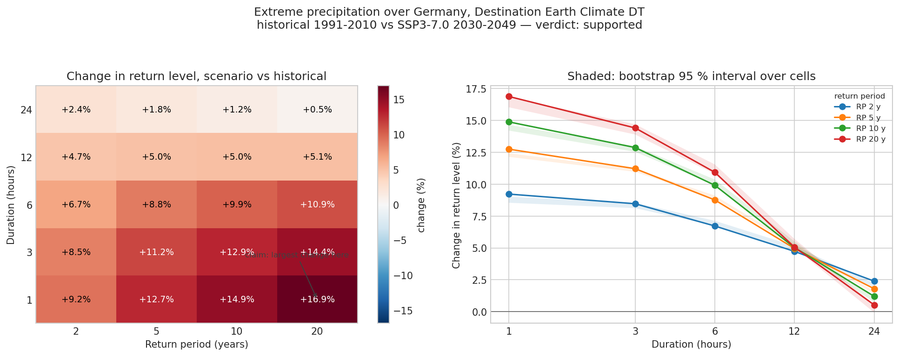

# Extreme precipitation return levels over Germany, replicated with Destination Earth

> Replication of the headline claim of **Hundhausen, Feldmann, Kohlhepp & Pinto (2024)**,
> *Climate change signals of extreme precipitation return levels for Germany in a
> transient convection-permitting simulation ensemble*,
> [10.1002/joc.8393](https://doi.org/10.1002/joc.8393).

:::{attention} Destination Earth data attribution
This data is created based on data of the European Union, using the Destination Earth Platform, but has been modified by Anne Fouilloux.

Derived from Destination Earth Climate DT output by aggregation and transformation
(hourly accumulation, annual block maxima, extreme-value fitting). It is **not**
original DestinE data and must not be presented as such. DestinE Terms and
Conditions v2.0, Articles 2.3, 3.3 and 3.4.

The ~23 GB hourly retrieval is **not** redistributed (Art. 2.5); the derived
annual maxima and return levels are, so the result can be checked without a
DestinE account. [`data/README.md`](data/README.md) sets out what is shared,
what is not, and why the shared files cannot be used to reconstruct the original.
:::

## The claim under test

From the paper's Abstract, restated in its Conclusions:

> "A maximum climate change signal of 6–8.5% increase per degree of GW is projected
> within the CP ensemble, **with the largest changes expected for short durations and
> long RPs**."

The transferable half of that — *where* the largest changes sit — is what this study
tests, stated as an AIDA sentence carrying no region, model or number:

> Under global warming, extreme precipitation events of short duration and long return
> period intensify proportionally more than events of long duration and short return
> period.

## Result: supported

Change in return level, SSP3-7.0 **2030–2049** against historical **1991–2010**,
median over 8,697 cells:

| Duration | RP 2 y | RP 5 y | RP 10 y | RP 20 y |
|---|---|---|---|---|
| **1 h** | +9.22 % | +12.75 % | +14.89 % | **+16.88 %** |
| 3 h | +8.47 % | +11.22 % | +12.88 % | +14.41 % |
| 6 h | +6.72 % | +8.77 % | +9.92 % | +10.93 % |
| 12 h | +4.73 % | +4.96 % | +5.03 % | +5.06 % |
| **24 h** | **+2.39 %** | +1.80 % | +1.20 % | +0.53 % |

The largest change in the entire matrix, **+16.88 %, is at 1 h / 20 y** — precisely the
short-duration, long-return-period corner the paper names. The change falls
monotonically with duration at every return period (Kendall τ = −1.000).



**The result holds in a completely different modelling framework.** The paper used a
four-member ensemble of GCM-driven COSMO-CLM convection-permitting simulations at
2.8 km under RCP 8.5, with a peak-over-threshold partial series and an exponential fit.
This study used a single coupled global Earth-system model at ~5 km under SSP3-7.0,
with a regional index-flood GEV fitted by L-moments to annual maxima. Neither the input
data nor the statistics are shared, which is what makes the agreement informative: it
tests the claim rather than the pipeline.

## An honest limitation

At **24 hours the ordering reverses**: the change *decreases* with return period, from
+2.39 % at RP 2 y to +0.53 % at RP 20 y (τ = −1.000). Rarer daily totals change least.
This does not contradict the claim, which is about where the maximum sits — but it says
the intensification is concentrated in short-duration convective extremes and is largely
absent for rare multi-hour totals.

## Magnitude, and why it is not a like-for-like comparison

Global-mean warming between the two windows is **0.93 K**, giving +9.9 %/K at 1 h / RP 2 y
rising to **+18.2 %/K** at 1 h / RP 20 y, and +2.6 %/K down to +0.6 %/K at 24 h.

The paper reports **6–8.5 %/K**. These numbers are *not* directly comparable: the paper's
is a maximum across ensemble members from a POT/exponential fit over 1–72 h and return
periods to 100 y; this study's is a median over cells from a pooled GEV over 1–24 h and
return periods to 20 y. The short durations here sit at or above the paper's band and the
long ones below it, which is consistent with a steeper duration dependence in the
Climate DT.

## Data and method

| | |
|---|---|
| Data | Destination Earth **Climate DT generation 2**, IFS-NEMO, realization 1, hourly `clte` stream, `avg_tprate` |
| Resolution | `high` — native HEALPix level 10 (nside 1024, ~6.3 km) |
| Domain | Germany, 8,697 cells, via ECMWF Polytope server-side polygon extraction |
| Windows | 1991–2010 (`baseline`/`hist`) and 2030–2049 (`projections`/SSP3-7.0), 20 years each |
| Durations | 1, 3, 6, 12, 24 h backward rolling accumulations |
| Estimator | Regional index-flood GEV by L-moments; return levels 2, 5, 10, 20 y |
| Uncertainty | Bootstrap over cells, n = 400 |
| Volume | 480 monthly retrievals, ~23 GB |

Everything with a right and a wrong answer lives in `scripts/` with tests, not in the
notebooks: the GEV is checked against `scipy.stats.genextreme`, and the verdict logic is
checked against matrices whose answer is known by construction — including that a flat
matrix must not read as support.

**Coordinate systems.** The Climate DT is delivered on HEALPix defined on a *sphere*. The
analysis is repeated on HEALPix on the *WGS84 ellipsoid*, converted with
`healpix-resample`'s conservative (mass-preserving) operator. Both grids give the same
verdict, with a maximum disagreement of 0.000 percentage points — geolocation corrected,
statistics untouched. The correction matters at this resolution: 350 of 8,697 cells
(4.0 %) change Germany-membership between the two conventions.

## Reproducing this

```bash
git clone https://github.com/annefou/extreme-precipitation-climatedt-replication.git
cd extreme-precipitation-climatedt-replication
pixi install
pixi run check-destine     # verify your DestinE credential reaches the data
pixi run retrieve          # ~6 h, restartable, ~23 GB
pixi run snakemake --cores 1
```

Retrieval needs a [Destination Earth Service Platform](https://platform.destine.eu/)
account. Without one, `01_data_download.py` writes a clearly-stamped synthetic stand-in so
the rest of the pipeline still runs as a smoke test — every artefact it produces is marked
`provenance=synthetic` and must never be reported as a result.

## Structure

- `paper/` — the source paper.
- `notebooks/` — the four-stage pipeline (retrieve → annual maxima → GEV → figures).
- `scripts/` — the tested logic the notebooks call.
- `nanopubs/` — the FORRT chain, field by field, plus the published-URI registry.
- `results/`, `figures/` — real Destination Earth output, committed.

## Nanopublication chain

The published chain is listed in [`nanopubs/PUBLISHED.md`](nanopubs/PUBLISHED.md).

## Citation

- This work: [`CITATION.cff`](CITATION.cff) → DOI [10.5281/zenodo.22641171](https://doi.org/10.5281/zenodo.22641171).
- The original paper: [10.1002/joc.8393](https://doi.org/10.1002/joc.8393).
